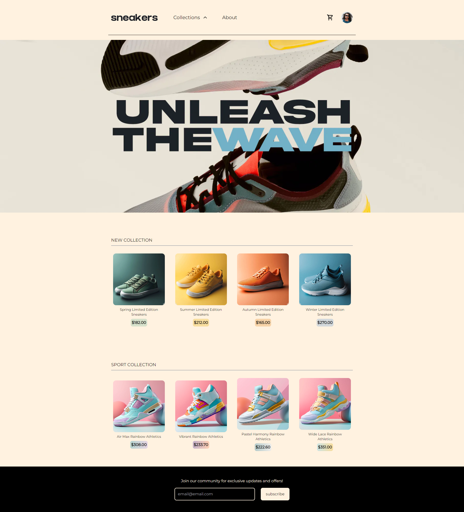
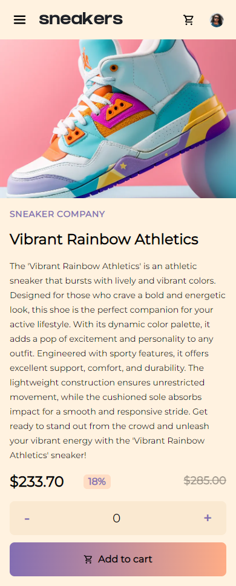

# Sneakers E-Commerce

  </img>

  </img>
  </img>

This is a simple responsive e-commerce project for seasonal sneakers, inspired by a project template from [FrontEnd Mentor](https://www.frontendmentor.io/challenges/ecommerce-product-page-UPsZ9MJp6). While the initial idea was derived from the template, I have made design modifications and implemented new functionality.

## Technologies Used

- Next.js
- Redux Toolkit
- TypeScript
- Headless UI

## Features

- Browse through selection of seasonal sneakers
- Add products to your cart and manage your cart
- View product details and images
- Add your e-mail in the company Newsletter
